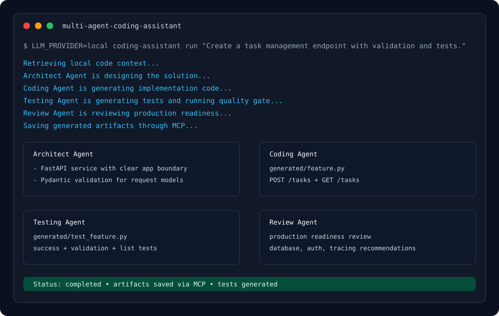

# Multi-Agent Coding Assistant

Production-style portfolio project: a coding assistant that turns a software requirement into a design, implementation artifact, test plan, and code review using a LangGraph multi-agent workflow.

It is intentionally runnable without cloud credentials through a local deterministic LLM provider, while keeping a real Vertex AI Gemini provider ready for production use.

## Demo



The assistant takes a natural-language requirement, retrieves repository context, runs specialized agents, persists generated artifacts through MCP, and returns implementation code, tests, and a review.

## What This Shows Recruiters

- Multi-agent orchestration with LangGraph.
- Clean model-provider abstraction for Vertex AI Gemini.
- Embedding-based local RAG retrieval over source files and docs.
- MCP client/server integration for safe repository file access.
- FastAPI backend, CLI entrypoint, tests, linting, and Docker packaging.
- A practical path to Cloud Run, GitHub PR automation, and evaluation metrics.

## Architecture

```mermaid
flowchart LR
    User[User Requirement] --> RAG[Embedding RAG Retriever]
    RAG --> Architect[Architect Agent]
    Architect --> Coder[Coding Agent]
    Coder --> Tester[Testing Agent]
    Tester -->|quality gate fails| Coder
    Tester -->|quality gate passes| Reviewer[Review Agent]
    Reviewer --> MCPClient[MCP Client]
    MCPClient --> MCPServer[MCP Repository Server]
    MCPServer --> Files[Generated Files]
    Files --> API[FastAPI / CLI Response]
```



## Tech Stack

- Python 3.11
- LangGraph
- FastAPI
- Model Context Protocol Python SDK
- Google Gen AI SDK for Vertex AI Gemini
- Pydantic
- pytest
- Ruff
- Docker

## Setup

You need Python 3.11 or newer. On macOS with Homebrew:

```bash
brew install python@3.11
```

Create and activate a virtual environment:

```bash
cd multi-agent-coding-assistant
python3.11 -m venv .venv
source .venv/bin/activate
pip install --upgrade pip
pip install -e ".[dev]"
cp .env.example .env
```

Run tests:

```bash
pytest
ruff check .
```

Run the API:

```bash
uvicorn coding_assistant.api.main:app --reload
```

Try it:

```bash
curl -X POST http://127.0.0.1:8000/assist \
  -H "Content-Type: application/json" \
  -d '{"requirement":"Create a task management endpoint with validation and tests."}'
```

Run from the terminal:

```bash
coding-assistant run "Create a task management endpoint with validation and tests."
```

The generated code is also saved to:

```text
sample_workspace/generated/feature.py
sample_workspace/generated/test_feature.py
```

`sample_workspace` comes from `WORKSPACE_ROOT` in `.env`, so you can point it at a different local folder when you want the assistant to write into another project.

## Using Vertex AI Gemini

The local deterministic model is for development and CI. To use Vertex AI, edit `.env`:

```bash
LLM_PROVIDER=vertex
GOOGLE_CLOUD_PROJECT=your-gcp-project-id
GOOGLE_CLOUD_LOCATION=global
GEMINI_MODEL=gemini-2.5-flash
GOOGLE_GENAI_USE_VERTEXAI=true
LLM_TIMEOUT_SECONDS=90
```

Authenticate with Google Cloud:

```bash
gcloud auth application-default login
```

This project uses the current Google Gen AI SDK style for Vertex AI:

```python
from google import genai
client = genai.Client(vertexai=True, project="your-project", location="global")
```

## MCP Repository Server

Run the MCP server locally:

```bash
python -m coding_assistant.mcp.repository_server
```

It exposes three safe tools:

- `list_files`
- `read_file`
- `write_file`

All paths are constrained to `WORKSPACE_ROOT` so agents cannot write outside the configured project folder.

The LangGraph workflow persists generated artifacts through the MCP client/server path:

```text
Graph -> MCP client -> MCP repository server -> safe repository tool -> filesystem
```

## Design Notes

See [docs/ARCHITECTURE.md](docs/ARCHITECTURE.md) for the workflow, component boundaries, and production roadmap.

Security notes are documented in [SECURITY.md](SECURITY.md).

## Roadmap

Near-term:

- Replace the local embedding provider with Vertex embeddings and store vectors in Vertex AI Vector Search or pgvector.
- Add real GitHub MCP integration for reading repositories and opening pull requests.

Evaluation:

- Add RAGAS or TruLens evaluation.
- Track faithfulness, answer relevance, and code-review pass rate over time.

Deployment:

- Add Terraform and Cloud Run deployment.
- Add Cloud Build CI checks.

## References

- LangGraph uses `StateGraph` to define typed graph state, nodes, edges, and compiled invocations.
- Google Cloud recommends the `google-genai` SDK for Gemini on Vertex AI.
- MCP servers expose tools through a standardized protocol, which makes agent integrations easier to swap and audit.
