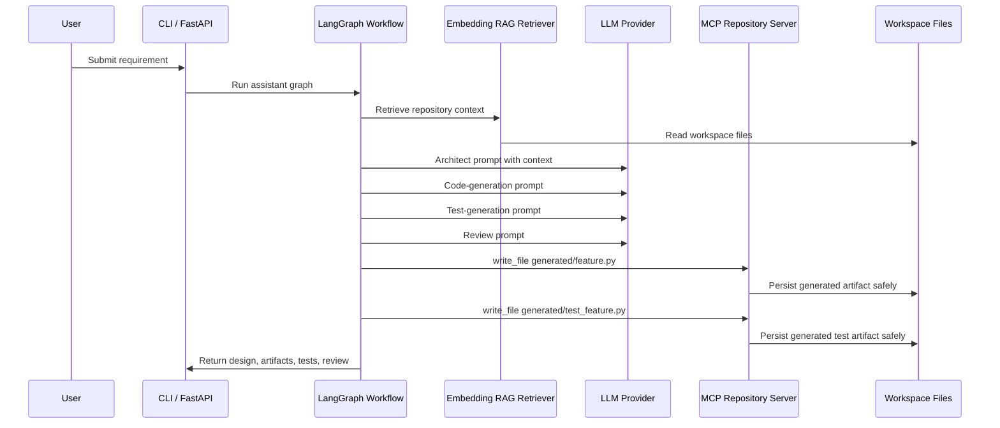

# Architecture

This project is a local-first multi-agent coding assistant. It is designed to be easy to run on a laptop while preserving patterns that map to production AI systems.

## Runtime Flow

## Design Choices

- **LangGraph orchestration:** keeps the workflow explicit and testable instead of hiding logic in one large prompt.
- **Agent roles:** separates architecture, implementation, testing, and review responsibilities.
- **Provider abstraction:** supports a local deterministic provider for CI and Vertex AI Gemini for real generation.
- **Embedding RAG:** retrieves relevant workspace context before generation.
- **MCP file tools:** generated artifacts are written through an MCP client/server boundary.
- **Safe repository access:** file writes are constrained to `WORKSPACE_ROOT`.

## Production Roadmap

- Replace local hash embeddings with Vertex AI embeddings.
- Store vectors in Vertex AI Vector Search or pgvector.
- Add a GitHub MCP server for branch creation, commits, and pull requests.
- Run generated tests in an isolated workspace and feed failures back to the graph.
- Add tracing and evaluation metrics for context relevance, faithfulness, and code quality.

